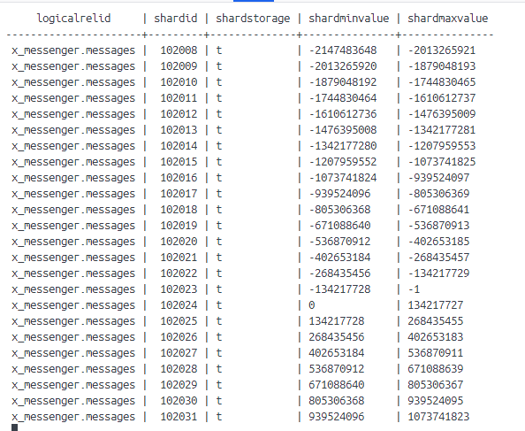

# Шардирование

Для шардирования необходимо из текущей директории запустить команду
```shell
docker compose up -d
```

Для завершения работы следует выполнить команду 
```shell
docker compose down
```

## Принципы шардирования

Для шардирования используется [citus](https://www.citusdata.com/). Шардирование производится по хэшу.
Точнее по диапазонам хэша:

.

Проблема горячей точки (эффект "Леди Гага") решается программно. В качестве идентификатора, по которому высчитывается
хэш, используется конкатенация двух uuid пользователей, между которыми происходит диалог. При чем конкатенация происходит
в порядке возрастания uuid-ов (используется сортировка). Т.к. у очень активного пользователя очень много диалогов, то 
с высокой вероятностью они будут равномерно распределены по шардам, т.к. часть его собеседников будет иметь uuid больше, а
часть меньше, плюс к этому сами uuid-ы - случайные величины и хорошо распределяются по диапазону значений хэша.

## Решардинг

Решардинг необходимо производить в ручном режиме, т.к. это сложный процесс, требующий контроля оператора.
Так как здесь используется фиксированное количество секций, то перебалансировка будет приводить к тому, что некоторые секции будут
размещаться на новых узлах. 

Для начала необходимо добавить новые узлы. Для этого в [docker-compose](docker-compose.yaml) у сервиса `worker` необходимо 
увеличить число `replicas`.

Затем необходимо подключиться к контейнеру shardin_master:
```shell
docker exec -it sharding_master bash
```
Подключиться к БД:
```shell
psql -d x_messenger
```

Затем выполнить команды:
```postgres-sql
alter system set wal_level = logical;
SELECT run_command_on_workers('alter system set wal_level = logical');
```

После необходимо выйти из контейнера, используя дважды команду `exit`.

Далее необходимо перезапустить сервисы:
```shell
docker compose restart master worker manager
```

Далее снова подключаемся к контейнеру и БД:
```shell
docker exec -it sharding_master bash
psql -d x_messenger
```

И запускаем перебалансировку:
```postgres-sql
SELECT citus_rebalance_start();
```

Ожидаем успешного статуса перебалансировки:
```shell
SELECT * FROM citus_rebalance_status();
```

О нем будет свидетельствовать запись `"task_state_counts": {"done": 18}`
